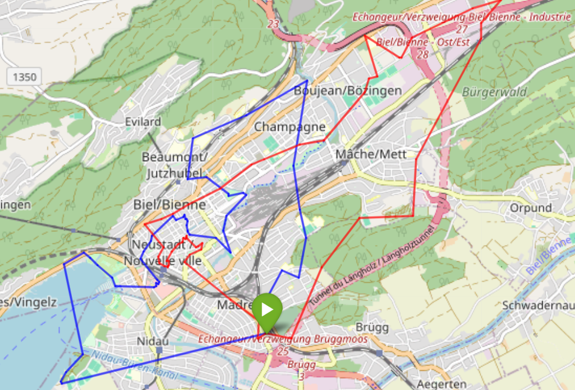

# Setting up the project for development

>  Docker needs to be installed on the system.

To start everything run `docker compose up` in the console.
This will start up the docker compose stack.
In the logs of the spark-1 container, there will be a link to jupyterhub with the token.
Either directly open this link or copy the token, then open `http://localhost:8888` and paste in the token.

For some notebooks, additional packages are required.
They can be directly installed on the jupyterhub server inside a console.

For intellisense you can also open the notebooks in vscode or pycharm,
then configure the jupyter server as the kernel with the copied token.
Then you need to install the packages locally for the interpreter,
for this run `poetry install --no-root`.

> Note: poetry needs to be installed for this to work.
> You can also go through the list of dependencies in the pyproject.toml and manually install the packages using pip

# Conceptualization work package 3/4

## Distance Matrix

For the route planning,
we need a distance matrix which gives us the distance and time from each garbage can to each garbage can.

|       | Bin 1 | Bin 2 | Bin 3 |
|-------|-------|-------|-------|
| Bin 1 | 0     | 280   | 650   |
| Bin 2 | 280   | 0     | 1430  |
| Bin 3 | 650   | 1430  | 0     |

### As the crow flies distance matrix

To calculate the distance matrix, we use the Haversine formula to determine the airline distance between the waste
garbage cans.

This formula takes into account the curvature of the earth and provides the shortest distance between two
points on the earth's surface based on their geographic coordinates (latitude and longitude).

The calculated distances are used as a basis for route planning by determining the distances between all garbage cans to
determine the most efficient order for collection.

### Google Maps Distance Matrix

The more optimized variant would be to create a distance matrix with the Google Routes API, where all points can be
entered, and we then get the travel time for a car and the distance in meters.

That would be the API:
https://developers.google.com/maps/documentation/routes?hl=de

The problem is that the maximum number of routes for a request is 625, i.e., 25 starting points and 25 destination
points.

Our distance matrix would be one that is 583 X 583, i.e., 339,889 routes.
Such a quantity would then incur costs of around CHF 1,456.

We have created an example matrix that does not exceed the free quantity of 625 routes. (60 X 10)

## Bin filling time

So that we don't just have to rely on the residents of Biel, we want to calculate how long it takes to fill a waste
garbage can.
We have two different solutions for this.

Since we have no data with which we can make these calculations for the current situation, we have created our own test
data, which is probably far from reality, but which allows us to make theoretically correct calculations.

In a real situation, data of several months or even years would be needed for serious calculations.

### Average filling time calculation

The easier way to get the fill time of the garbage cans was a simple calculation where we group all the data by garbage
can and then

### Prediction Machine Learning Model

The model uses historical notifications about the state of garbage cans (“full” or “emptied”) and analyzes temporal and
location-based patterns to predict the time to refill.
It integrates features such as time of day, day of week, and
average and deviation times to full capacity.
A random forest regressor is used to model the time to the next “full”
state, with additional predictions of whether a bin will be filled within a certain time frame.
For more information of the model see the notebook `notebooks/bin_full_prediction_model.ipynb`,
there more information and documentation can be found.

## Output route planning

As an output of the route planning, we wanted to create a map with the optimal route for emptying the garbage cans.
Using Folium and Streamlit, we connected the points as the crow flies and also displayed them on Google Maps.

### Folium Streamlit

We used Folium and Streamlit to visualize the optimal routes of two vehicles emptying litter garbage cans in
Biel/Bienne.
The map shows the planned routes of both vehicles in different colors to efficiently cover the selected
locations.

## Selection of bins' route planning

The selection of litter garbage cans that we want to consider in the route planning is covered by our two parts;

1. query on the database for the garbage cans that are already full

2. a list of garbage cans that are full, which is generated by our prediction model.

Then we take the union of the two sets.

## Route planning

At the beginning of the Special Week, we already thought about how to optimize the routes and discovered that this is a
classic Traveling Salesman problem.

On Tuesday morning we were informed by Prof. Dr. Heck that we can use the perfomant library from
Google, [OR-Tools](https://developers.google.com/optimization/examples?hl=de).

### Current modeling

To implement the use case, we modeled our data as follows to apply the library.

#### Data model

The data model describes all important parameters for the algorithm.

1. the distance matrix, which is based on aerial lines, with the first element as the start and end point

2. an ordered vector that describes the “load” of the respective locations, i.e., in our case, the volume of the waste
   garbage cans

3. number of vehicles traveling this route.

4. another ordered vector describing the capacity of the respective vehicles.

#### Additional dimensions

To ensure that our parameters are actually taken into account, we have two dimensions that act as constraints.

1. the distance dimension, which describes the maximum number of meters a vehicle should drive.
   Without this,
   the first vehicle would simply be able to drive without restriction and leave no location behind for the others

2. the capacity dimension, which describes that at each step the remaining capacity of the vehicle is added to the
   additional load of the location until the capacity is reached.

### Possible improvements

Now we already have a route planning, but it certainly has potential for improvement.

We would pursue the following points:

- Use a distance matrix that describes the real distances with driving routes.
